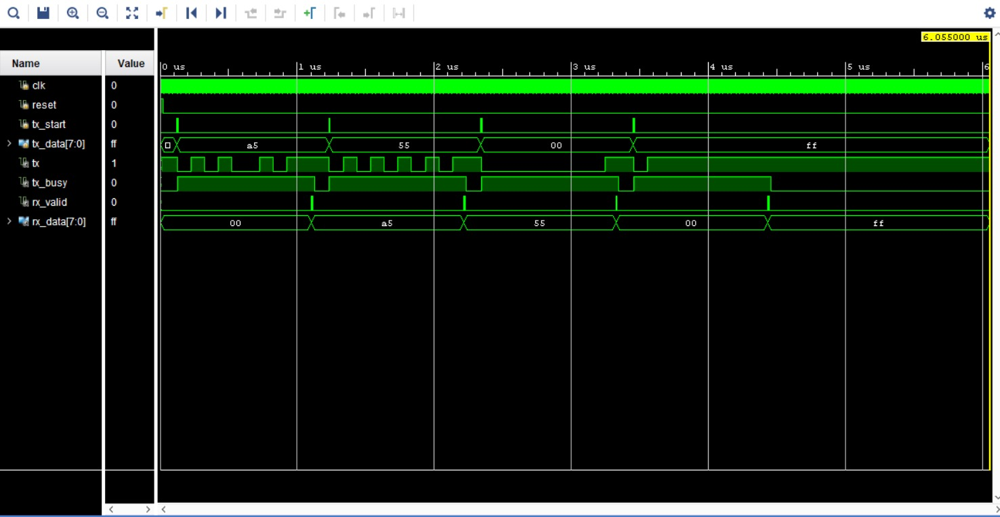
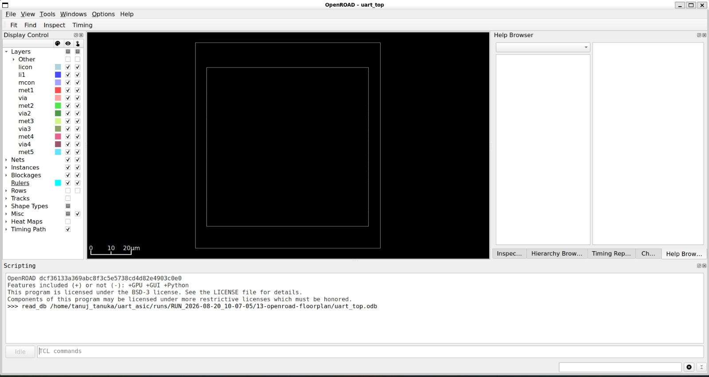
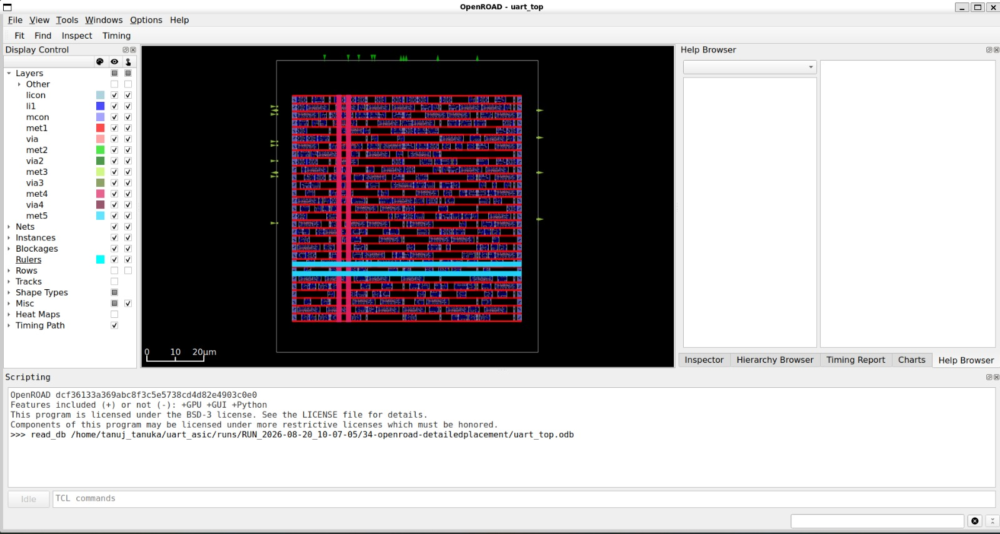
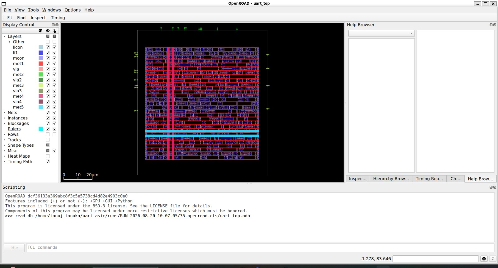
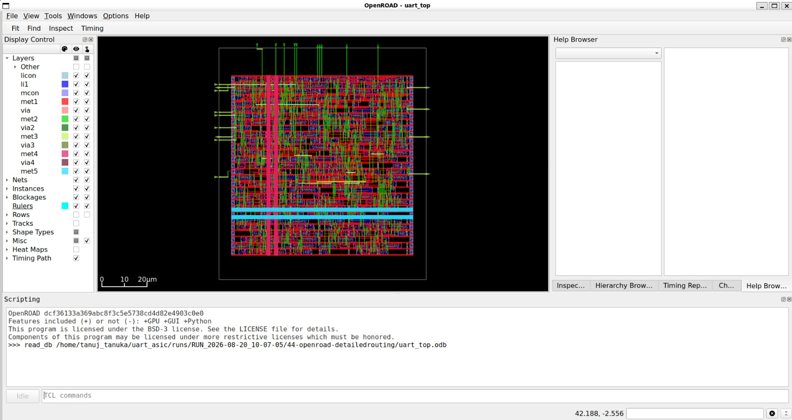
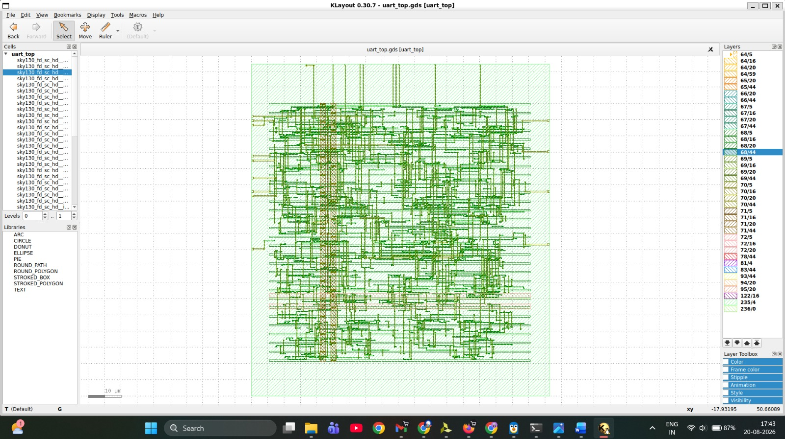

# UART ASIC: RTL-to-GDSII Physical Design using SKY130A

## 📋 Project Overview

This project implements an 8-bit UART (Universal Asynchronous Receiver/Transmitter) at the Verilog RTL level and carries it through a complete open-source ASIC physical-design flow — from synthesis to final GDSII layout generation.

The design was implemented through the following stages:


RTL
  → Yosys Synthesis
  → Floorplanning
  → Placement
  → Clock Tree Synthesis (CTS)
  → Routing
  → Parasitic Extraction
  → Post-route Static Timing Analysis (STA)
  → DRC
  → LVS
  → Final GDSII Generation


The implementation targets the **SkyWater SKY130A** open-source process design kit, using the **sky130_fd_sc_hd** standard-cell library. The project demonstrates a full digital ASIC implementation flow rather than stopping at RTL synthesis alone.


## 🧩 Design Architecture / RTL Modules

The UART design consists of the following Verilog modules:

| Module | Description |
|---|---|
| `uart_tx.v` | UART transmitter |
| `uart_rx.v` | UART receiver |
| `uart_top.v` | Top-level UART integration module |

**Top-level I/O:**

| Signal | Direction | Description |
|---|---|---|
| `clk` | Input | System clock |
| `reset` | Input | Synchronous/asynchronous reset |
| `tx_start` | Input | Pulse to initiate transmission |
| `tx_data[7:0]` | Input | Byte to be transmitted |
| `rx` | Input | Serial receive line |
| `tx` | Output | Serial transmit line |
| `rx_data[7:0]` | Output | Received byte |
| `rx_valid` | Output | Indicates valid received data |
| `tx_busy` | Output | Indicates transmitter is active |


## ⚙️ Design Parameters

| Parameter | Value |
|---|---|
| Design | 8-bit UART |
| Target Technology | SkyWater SKY130A |
| Standard Cell Library | sky130_fd_sc_hd |
| Target Clock Frequency | 100 MHz |
| Clock Period | 10 ns |
| Baud Rate | 1 Mbps |

The 10 ns clock period corresponds to a target operating frequency of:

```
F = 1 / T = 1 / 10 ns = 100 MHz
```


## 🛠️ Tools and Technologies

| Tool | Purpose |
|---|---|
| Verilog | RTL design |
| Yosys | RTL synthesis |
| LibreLane | Automated RTL-to-GDSII implementation flow |
| OpenROAD | Floorplanning, placement, CTS, and routing |
| OpenSTA | Static timing analysis |
| KLayout | Final GDSII visualization |
| SKY130A | Process design kit |
| Nix | Tool/environment management |

LibreLane orchestrated the overall flow, with OpenROAD performing the underlying physical-design stages (floorplanning, placement, CTS, and routing) as part of that flow.

## 🔬 RTL Synthesis

Synthesis converts the UART RTL into a gate-level netlist mapped to Sky130 standard cells, using Yosys.

**Verified synthesis results:**

| Metric | Value |
|---|---|
| Cells | 281 |
| Flip-Flops | 66 |
| Wire Bits | 293 |
| Ports | 9 |
| Synthesized Cell Area | ~3228.096 µm² |
| Sequential Element Area Share | ~43.49% |

The synthesized netlist includes standard cells such as flip-flops, AND, OR, NAND, NOR, MUX, and inverter gates.


## 🧪 Functional Simulation (Vivado)

Before proceeding to physical implementation, the UART RTL was functionally verified through simulation in Xilinx Vivado. This step confirms correct logical behavior of `uart_top` independent of the physical-design flow — Vivado was used here strictly for simulation, not for FPGA synthesis or deployment.

**Simulation scope:**

- Clock generation and reset behavior
- `tx_start` → serialization → `tx` output timing
- Loopback verification: `tx` output connected to `rx` input to validate the complete TX–RX datapath
- `tx_busy` assertion/de-assertion across a full transmit cycle
- `rx_valid` and `rx_data` correctness against known input bytes

**Test cases:** `0x55`, `0xAA`, `0x00`, `0xFF`, and multiple consecutive back-to-back byte transmissions.

The waveform output confirmed that transmitted bytes were correctly reconstructed at the receiver, with `rx_data` matching the corresponding `tx_data` for each test case, and `rx_valid`/`tx_busy` asserting at the expected cycle boundaries.

Simulation waveform: 




## 🗺️ Floorplanning

Floorplanning establishes the physical die and core boundaries before placement and routing occur. This defines the overall silicon area the design will occupy and sets up the initial power-grid framework.


This is an early physical-design checkpoint showing only the die/core definition — it is not the final routed layout.



*Figure: Initial floorplan showing the die and core boundaries.*

## 📍 Placement

Placement physically positions the synthesized standard cells within the defined core area, aiming for a routable and timing-aware arrangement that minimizes wirelength and congestion.




*Figure: Standard-cell placement after detailed placement.*


## ⏱️ Clock Tree Synthesis (CTS)

CTS builds a clock distribution network that delivers the clock signal to all sequential elements while managing clock skew and insertion delay.

**Verified CTS results:**

| Metric | Value |
|---|---|
| Clock Roots | 1 |
| Clock Sinks | 66 |
| Inserted Clock Buffers | 9 |
| Clock Subnets | 9 |




*Figure: Clock Tree Synthesis stage.*


## 🔌 Routing

Routing occurs in two stages:
- **Routing** — creates the actual physical metal and via connections in accordance with SKY130 design rules.

The detailed-routing ODB represents the fully routed physical implementation.



*Figure: Detailed routing stage showing the routed physical implementation.*


## 📐 Parasitic Extraction

After routing, the parasitic resistance and capacitance of the physical interconnect are extracted and represented in Standard Parasitic Exchange Format (SPEF) files. These extracted parasitics are used as input for post-route timing analysis.

Generated SPEF files:

```
final/spef/max/uart_top.max.spef
final/spef/min/uart_top.min.spef
final/spef/nom/uart_top.nom.spef
```

These files represent extracted interconnect parasitics for timing purposes; they are not a layout representation themselves.


## ⏳ Post-Route Static Timing Analysis (STA)

Post-route STA was performed using the routed netlist, the Liberty timing library, SDC constraints, and the extracted SPEF parasitics, targeting a 10 ns (100 MHz) clock period.

- **Setup check** verifies that data arrives before the next active clock edge.
- **Hold check** verifies that data remains stable for the required time after the active clock edge.
- Positive slack indicates the analyzed timing path has margin beyond the requirement.

**Verified timing results:**

| Metric | Result |
|---|---:|
| Clock Period | 10 ns |
| Clock Frequency | 100 MHz |
| Worst Setup Slack (WNS) | +4.26 ns |
| Worst Hold Slack | +0.32 ns |
| Setup | PASS |
| Hold | PASS |

Post-route STA reported positive setup and hold slack for the analyzed timing paths.

Some OpenSTA warnings were encountered regarding certain physical-only/library cells not being available in the loaded Liberty context; these were treated as black boxes during analysis. This is noted here for completeness rather than omitted.


## 📏 Design Rule Check (DRC)

DRC verifies that the physical layout obeys the SKY130 manufacturing rules, including:

- Minimum spacing
- Minimum width
- Via rules
- Enclosure rules
- Geometry constraints

**Result:** `COUNT: 0`

| Check | Result |
|---|---|
| DRC | PASS |
| Violations | 0 |


## 🔍 Layout Versus Schematic (LVS)

LVS checks whether the extracted physical layout corresponds to the intended gate-level netlist.

**Verified results:**

| Metric | Layout vs Schematic |
|---|---|
| Devices | 392 vs 392 |
| Nets | 402 vs 402 |

The LVS report states: *"Netlists match uniquely"* and *"Final result: Circuits match uniquely."*

**LVS: PASS**

This confirms layout-netlist correspondence only, not silicon-level verification.


## 🏁 Final GDSII

GDSII is the final layout/mask-level representation generated by the ASIC implementation flow, containing the complete physical geometry of the design.


The final layout was inspected using KLayout.

This project produced a final GDSII layout as an academic RTL-to-GDSII exercise. No fabrication or tapeout was performed.



*Figure: Final UART GDSII layout viewed in KLayout.*


## 📊 Final Results Table

| Stage / Check | Result |
|---|---|
| RTL Synthesis | Completed |
| Floorplanning | Completed |
| Placement | Completed |
| Clock Tree Synthesis | Completed |
| Global Routing | Completed |
| Detailed Routing | Completed |
| Parasitic Extraction | Completed |
| Post-route STA | PASS for analyzed timing paths |
| Worst Setup Slack | +4.26 ns |
| Worst Hold Slack | +0.32 ns |
| DRC | PASS — 0 violations |
| LVS | PASS — Circuits match uniquely |
| Final GDSII | Generated |


## 📁 Repository Structure

```
uart-asic-rtl-to-gdsii/
│
├── src/
│   ├── uart_tx.v
│   ├── uart_rx.v
│   └── uart_top.v
│
├── synthesis/
│   ├── uart_synth.v
│   └── synthesis_report.txt
│
├── post_route_sta/
│   ├── run_sta.tcl
│   └── post_route_sta.rpt
│
├── results/
│   ├── images/
│   │   ├── floorplan.jpeg
│   │   ├── placement.jpeg
│   │   ├── cts.jpeg
│   │   ├── routing.jpeg
│   │   └── final_layout.jpeg
│   │
│   └── reports/
│       ├── synthesis_stat.rpt
│       ├── cts.rpt
│       ├── post_route_sta.rpt
│       ├── drc.rpt
│       └── lvs.rpt
│
├── config.yaml
└── README.md
```


## 🎓 Key Learning Outcomes

- Gained hands-on understanding of the complete RTL-to-GDSII ASIC implementation flow using open-source tools.
- Learned how synthesis, floorplanning, placement, CTS, and routing progressively transform an RTL description into a manufacturable physical layout.
- Understood the role of parasitic extraction and post-route STA in verifying real-world timing behavior.
- Learned to interpret DRC and LVS reports as independent physical-verification signoffs.
- Built familiarity with the SKY130A open-source PDK and the sky130_fd_sc_hd standard-cell library.
- Developed practical experience with the LibreLane/OpenROAD toolchain, including ODB, DEF, and GDSII data representations.


## 📌 Conclusion

This project demonstrates a complete academic implementation of an 8-bit UART design, carried from RTL through synthesis, physical implementation, verification, and final GDSII generation using the open-source SKY130A ASIC flow. All reported results — synthesis statistics, timing analysis, DRC, and LVS checks — were generated as part of this implementation and verification process. No fabrication or silicon validation was performed; this is strictly an RTL-to-GDSII physical-design exercise.


## 🧰 Tools & Technologies

`Verilog` `Yosys` `LibreLane` `OpenROAD` `OpenSTA` `KLayout` `SKY130A` `Nix`

